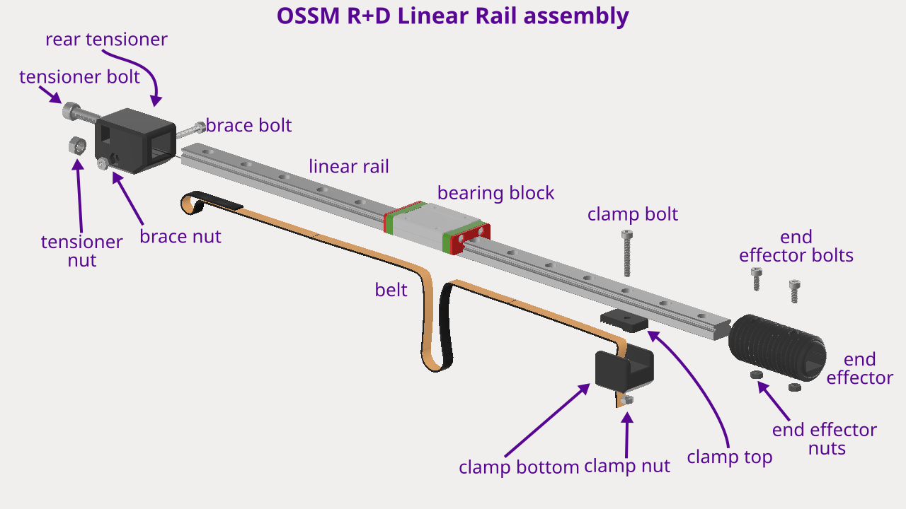
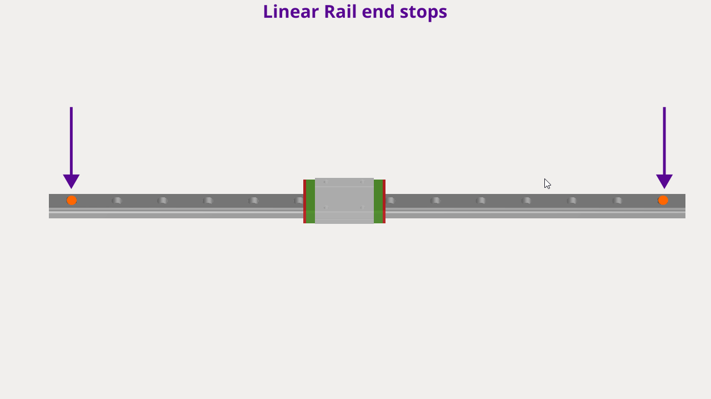
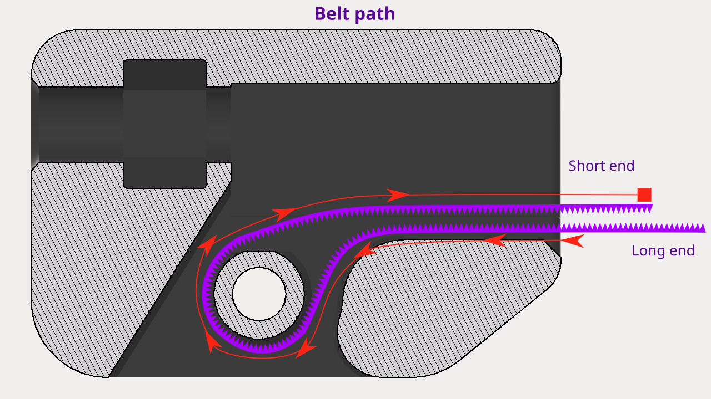
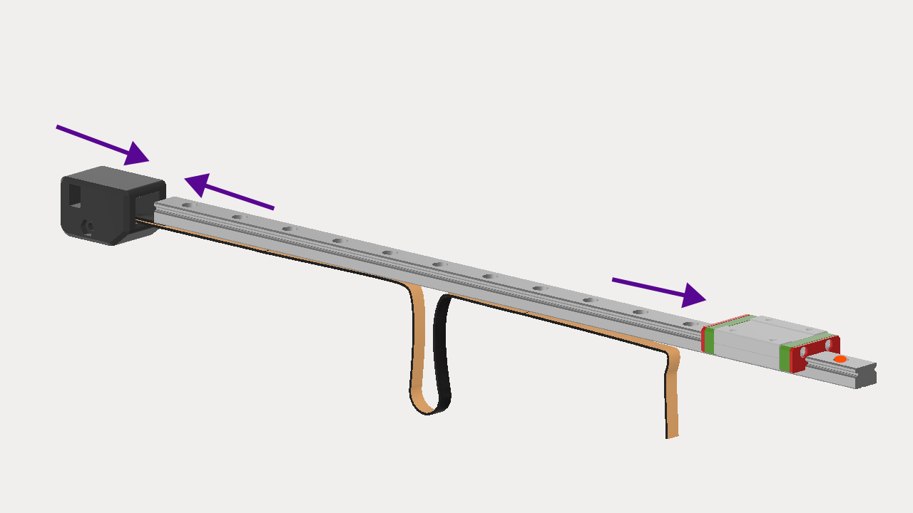
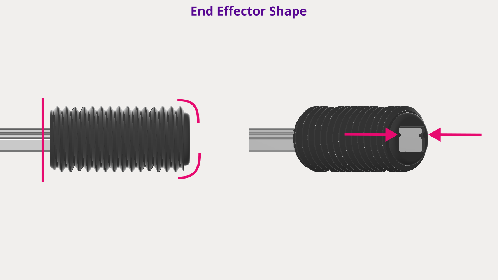
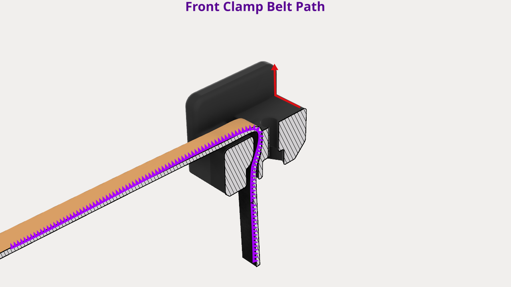
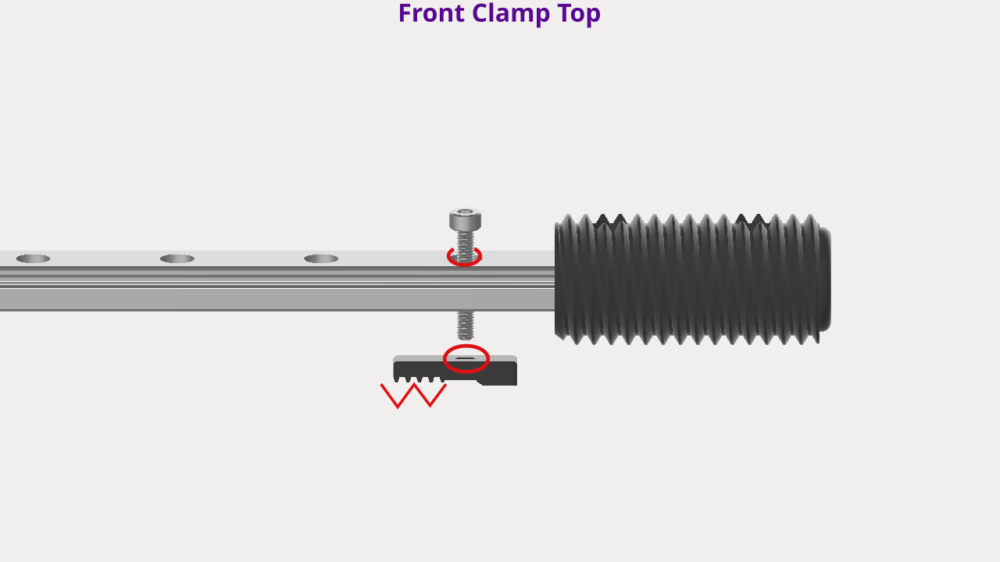

# Linear Rail Assembly

## Summary

💡 Add belt, rear tensioner, end effector, and front clamp to the linear rail. You want to do this first, to prevent the bearing block from sliding off accidentally.

[🎬 OSSM Complete Assembly - Follow Along Guide](https://www.youtube.com/watch?v=9lVobSEw_Uw)

***

## Exploded View

<figure><figcaption></figcaption></figure>


These part names are used in the instructions below.


***

## Instructions

***

### Step 1: Linear rail inspection

<figure><figcaption></figcaption></figure>

1. **End stop inspection**
   1. Inspect the linear rail and make sure end stops are in place.
   2. If the end stops are not installed, place a rubber band or a bolt with a nut (nut on top) at each end of the rail to prevent the bearing block from sliding off.

   
   If end stops are not in place, the bearing block can slide off the rail, and bearings will scatter **EVERYWHERE**.
   

   3. Slide the bearing block back and forth on the rail to ensure it's sliding freely.
   4. <mark style="color:red;">TODO - figure out if we need to apply lube or grease to rail?</mark>

***

### Step 2: Route belt through rear tensioner

1. **Orient parts**
   1. Hold the rear tensioner with the belt slot to the right and with the belt teeth facing up.
2.  **Route the Belt**
    1. Feed the belt through the rear tensioner along the path indicated in red in the image below.

    
    To help feed the belt through, fold the left end on itself so the flat sides  are touching and hold it for a few seconds. Then let go and feed it through.
    

    
<figure><figcaption></figcaption></figure>

    1. If you've done this right the belt should look like the purple line in the image above and the teeth should be facing each other.

1. **Adjust the Belt**
   1. Adjust the short end of the belt so that 1-2 cm (or 4-5 teeth) exit the rear tensioner.
   2. Pull the long end to remove any slack.

### Step 3: Add rear tensioner to rail

1. **Orient parts**
   1. Hold the linear rail so the bearing block is facing upwards.
   2. Move the bearing block to the right side (to prevent it from accidentally sliding off).
   3. Remove the end stop from the left side of the linear rail.

   
   At this point the linear rail is non-directional. Meaning it doesn't matter which end you decide is "left" or "right". But once you attach the rear tensioner that end will become the "left" or "back" or the linear rail.
   

1.  **Attach the Rear Tensioner**
    1. Slide the left end of the linear rail into the right side of the rear tensioner ensuring the belt is beneath the linear rail.

    <figure><figcaption></figcaption></figure>

    1. Pull the long side of the belt to take up any slack that was created.
2. **Install brace fasteners**
   1. Place the tensioner brace nut (M3) into the hexagonal hole on the left hand side of the rear tensioner.
   2. Insert the tensioner brace bolt (M3x20mm) into hole on the opposite side and tighten to _Snug_ using a 2.5mm hex bit/key.
3. **Install tensioner fasteners**
   1. Place the tensioner nut (M5) into the vertical slot on the left hand side of the rear tensioner.
   2. Insert the tensioner bolt (M5x16mm) into the back of the rear tensioner and _Finger-tighten_ only.


Over-tightening this bolt will push the rail out of the rear tensioner. You will adjust this bolt later on, so _Finger-tighten_ only.


### Step 4: Add end effector to rail

1. **Prepare the Linear Rail**
   1. Hold the linear rail so the bearing block is facing upwards.
   2. Move the bearing block to the left side (to prevent it from accidentally sliding off).
   3. Remove the end stop from the right side of the linear rail.
1. **Attach the End Effector**
   1. Slide the end effector onto the linear rail flat side first.
   2. Line up the holes in the end effector with the holes in the linear rail.

    <figure><figcaption></figcaption></figure>

    
    💡 Notice that the end effector has a flat side and a beveled side. Also note the protrusions that should line up  with the linear rail's grooves.
    

1. **Insert bolts**
   1. Insert 2 end effector bolts (M3x8mm) into the top holes of the end effector.
1. **Flip the Linear Rail Assembly**
   1. Hold the bolts in place with 2 fingers.
   2. Carefully flip the entire linear rail assembly over, to expose the bottom of the end effector.
1. **Insert nuts**
   1. Insert 2 end effector nuts (M3) into the bottom holes of the end effector.
1. **Flip Back and Tighten**
   1. While holding the nuts in place with two fingers, flip the assembly back over so the bolts are facing up again.
   2. Tighten both bolts to _Firm_ using a 2.5mm hex bit/key.


At this point the bearing block is now secure! You no longer have to worry about it sliding off.


### Step 5: Add front clamp to rail 

1. **Route belt through front clamp bottom**
   1. Hold the front clamp bottom so that channel is facing upwards.
   2. Route the belt through the top slot and out of the bottom like in the image below.
2.  At this point you only need about 5cm of length exiting the front clamp bottom

    <figure><figcaption></figcaption></figure>
3. **Add nut to front clamp bottom**
   1. Insert the front clamp nut (M3) into the hexagonal hole on the bottom of the front clamp bottom.
4. **Add front clamp top and bolt**
   1. Insert the front clamp bolt (M3x20mm) bolt into the linear rail.
   2. Use the first hole to the left of the end effector.
   3.  Hold the front clamp top so it's teeth are facing away from the bottom of the linear rail and to the left.

       <figure><figcaption></figcaption></figure>
   4. Align the hole in the front clamp top with the front clamp bolt in the linear rail and slide it on.
5. **Mate front clamp pieces**
   1. Align the hole in the front clamp bottom with the front clamp bolt in the linear rail and slide it on.
   2. Push the front clamp bolt down until it meets the front clamp nut. Then tighten to _Snug_.
