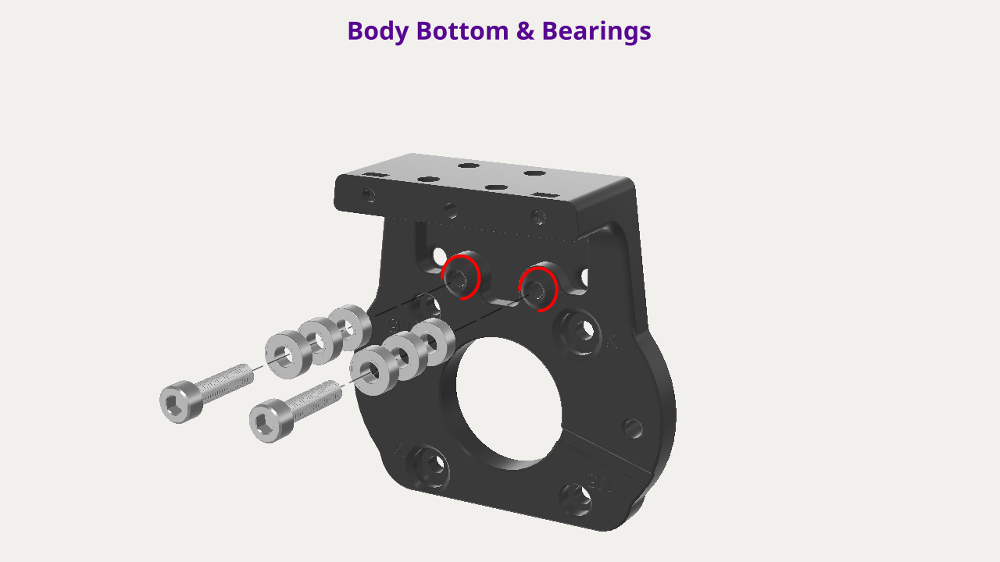
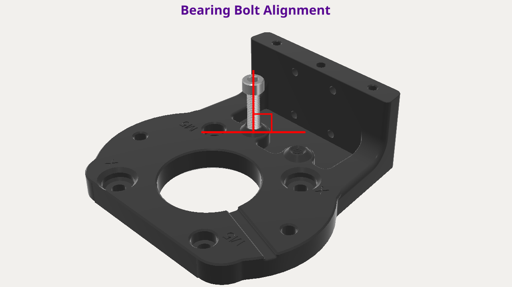
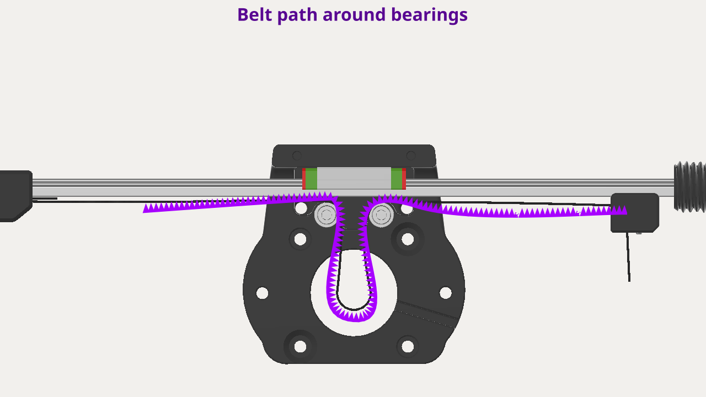

# Body Bottom & Rail Assembly

## Summary

💡Add the linear rail assembly that you just built to the body bottom.

## Components

<figure><figcaption></figcaption></figure>


These part names are used in the instructions below.


### Components & Tools

* [ ] <mark style="color:red;">Components</mark>
  * [ ] <mark style="color:red;">Linear Rail Assembly</mark>
* [ ] <mark style="color:red;">Printed Parts</mark>
  * [ ] <mark style="color:red;">Body Bottom</mark>
* [ ] <mark style="color:red;">Fasteners</mark>
  * [ ] <mark style="color:red;">M5x20mm Socket Cap Bolts</mark>&#x20;
  *
* [ ] <mark style="color:red;">Tools</mark>

***

## Instructions

***

### Step 1: Body Bottom & Bearings

1. **Pre-thread bolt holes**
   1.  Use a single bearing bolt (M5x20mm) and pre-thread the bearing bolt holes indicated by the red semi-circles in the image above.&#x20;

       <figure><figcaption></figcaption></figure>
   2.  When screwing in the bolt, make sure <mark style="color:red;">**the bolt is perpendicular to the body bottom**</mark><mark style="color:red;">.</mark>

       
<figure><figcaption></figcaption></figure>

   3. Repeat on the second bearing bolt hole.
2. **Add bearings to bolt and body**
   1. Add 3 bearings to a bearing bolt (M5x20mm) and screw it into a bearing bolt hole.
   2. Tighten until it bottoms out. No need to over tighten.
   3. Repeat steps "a" and" b" for the second bearing bolt hole.
3. **Test bearing movement**
   1. Rub your finger over each set of bearings and make sure they can spin freely.

***

### Step 2: Combine Body Bottom & Rail Assembly

<figure><figcaption></figcaption></figure>

1. **Add rail to body bottom**
   1. Place the body bottom flat on your work surface.&#x20;
   2. Slide the linear rail into place, with the end effector to the right, and making sure to line up the bearing block with the bearing block holes in the body bottom.
2. **Add bolts in crisscross pattern**
   1. Insert bearing block bolt #1 (M3x8mm) into the hole indicated in the image above and tighten to _snug._
   2. Repeat for bolts 2-4 in the crisscross order indicated in the image above.
3. **Tighten bolts and route belt**
   1. Once all bolts are snug, tighten each one to _firm_, repeating the crisscross tightening pattern performed in the previous step.
4.  **Route belt**

    1. If you haven't done so already, route the belt so that it forms a loop between the bearings, as indicated in the image below.

    <figure><figcaption></figcaption></figure>
