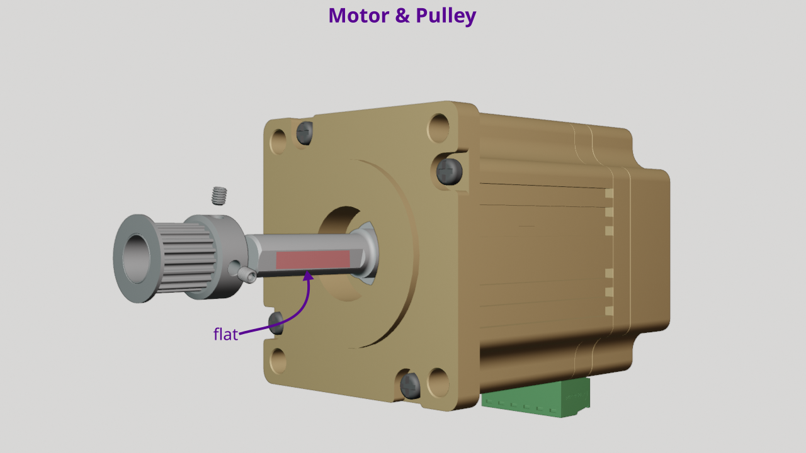
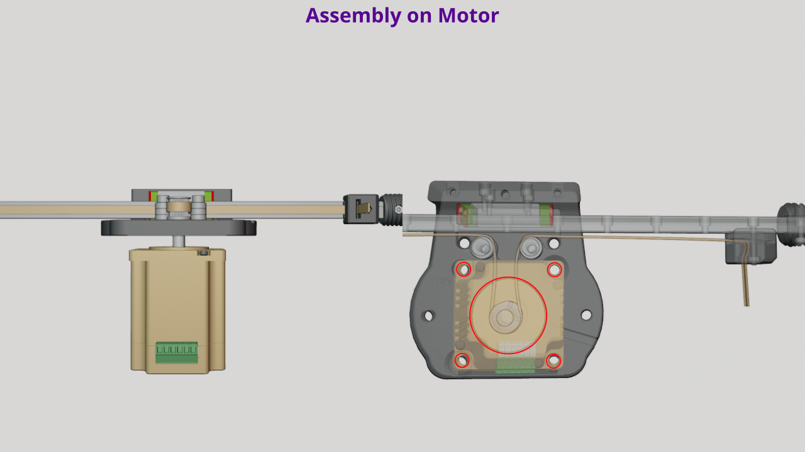
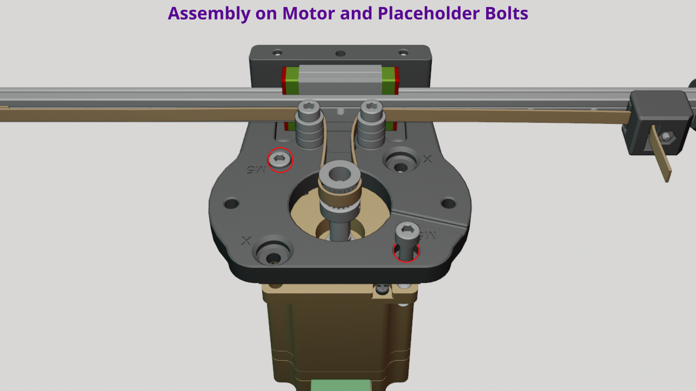
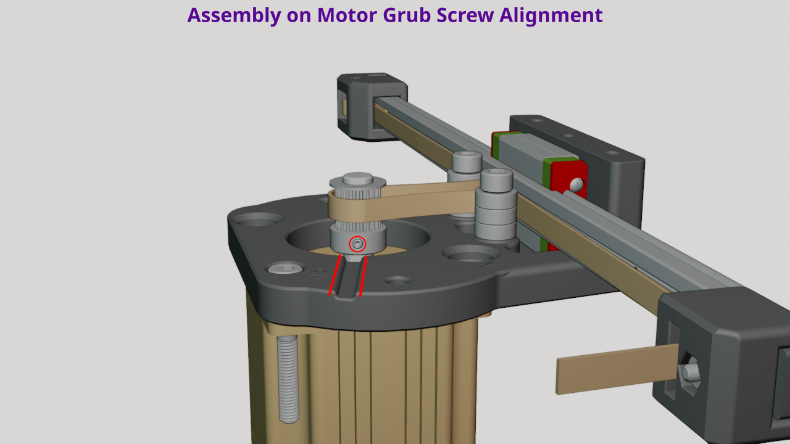
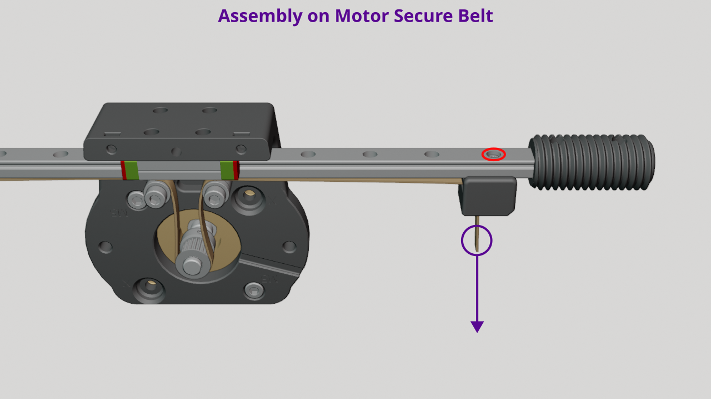

# Motor & Pulley Alignment

## Summary

💡 You'll install the pulley onto the motor shaft, leaving it loose. Position the motor on the assembly with placeholder bolts to hold it in alignment. Use the belt to align the pulley with the bearings, then secure both the pulley and the belt.

## Exploded View

<figure><figcaption></figcaption></figure>


These part names are used in the instructions below.


***

## Instructions

***

### Step 1: Motor prep

<figure><figcaption></figcaption></figure>

1. **Add pulley to motor shaft**
   1. Slide pulley onto the motor shaft, so the grub screws are closest to the motor body.
2. **Align and loosely tighten grub screws**
   1. Rotate the pulley so that a grub screw hole is over the flat part of the motor shaft.
   2. Lightly tighten the grub screw, so that it can still move up and down the motor shaft but not rotate.&#x20;
      1. We want it loose so we can align it with the bearings later.

***

### Step 2: Add assembly to motor

<figure><figcaption></figcaption></figure>

1. **Position the motor upright**
   1. Position the motor, so that side opposite the motor shaft is sitting on your worksurface.
2. **Align holes and pulley with belt**
   1. Place the assembly on the motor, aligning the holes on the body bottom with the holes in the motor.
   2. Make sure the belt is routed around the pulley.
      1. Don't worry if the belt isn't wrapped tightly around the pulley. You'll be doing that next.
3. **Add placeholder bolts**
   1. Place 2 M5x35mm bolts in the holes indicated in the image below.
      1. These should pass through the body bottom and motor body.
      2. No nuts are necessary at this point, as these are just placeholder bolts to make sure the body bottom is aligned with the motor.

<figure><figcaption></figcaption></figure>

***

### Step 3: Pull belt to align pulley

1. **Loosen front clamp bolt**
   1. On the front clamp, loosen the bolt just enough to allow the belt to move by pulling on it.
2. **Position & pull the belt**
   1. Make sure the belt is wrapped around the pulley.&#x20;
   2. Using one hand to hold the assembly and motor in place.
   3. Use your other hand to pull the belt from bottom of the front clamp.
      1. The idea is that the belt will pull the pulley into alignment. You don't need to pull very hard. Just enough so the belt brings the pulley into alignment with the bearings on the body bottom.
3.  **Check pulley alignment**

    1. Let go of the belt and inspect the pulley's vertical position on the motor shaft.
    2. Make sure the pulley is aligned with the bearings. The positioning isn't critical, but you ideally want the top of the pulley to line up with the top of the bearing stack.

    <figure><figcaption></figcaption></figure>
4. **Rotate pulley and tighten**
   1. With the pulley vertically aligned, push or pull the end effector to rotate the pulley until 1 of the 2 grub screws aligns with the hex key slot in the body bottom.&#x20;
      1.

          <figure><figcaption></figcaption></figure>
   2. _Fully tighten_ the grub screw.
   3. Push or pull the end effector again to rotate the pulley so the 2nd grub screw is aligned with the hex key slot.&#x20;
   4. Then _fully tighten_ the 2nd grub screw.

***

### Step 4: Secure the belt

<figure><figcaption></figcaption></figure>

1. **Tighten belt**
   1. Grab the belt protruding from the bottom of the front clamp and pull to remove any slack.
   2. Continue pulling on the belt to maintain its tension until the front clamp is secure.
      1. Don't worry too much if you can't pull with a lot of force, because you will be able to add additional tension using the rear tensioner bolt.&#x20;
2. **Tighten front clamp bolt**
   1. Tighten the front clamp bolt to _firm_.

***

### Step 5: Travel test & inspection

1. **Test travel**
   1. Push and pull on the end effector to move the linear rail back and forth a few times.
   2. You want to make sure the linear rail is traveling smoothly.
2. **Inspect belt**
   1. As you continue to push and pull on the end effector, inspect the belt to make sure it's in contact with the 3 bearings.
   2. If any part of the belt is not traveling along the bearings, you will need to adjust to pulley.
      1. To do so, loosen the grub screws enough to adjust the height of the pulley on the motor shaft.&#x20;
      2. Make sure to when you retighten that a grub screw is located on the flat part of the motor shaft.
